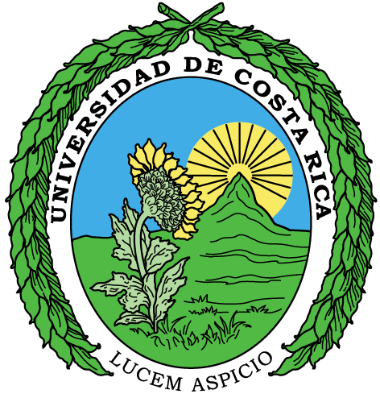

class: center, middle 

```{css echo=FALSE}
.highlight-last-item > ul > li, 
.highlight-last-item > ol > li {
  opacity: 0.5;
}
.highlight-last-item > ul > li:last-of-type,
.highlight-last-item > ol > li:last-of-type {
  opacity: 1;
}

.padded {
  padding-left: 70px
}
```

```{r xaringan-tile-view, echo=FALSE}
xaringanExtra::use_tile_view()
```

```{r xaringan-animate-all, echo=FALSE, eval=FALSE}
xaringanExtra::use_animate_all("slide_left")
```

```{r xaringan-tachyons, echo=FALSE}
xaringanExtra::use_tachyons()
```

```{r xaringan-logo, echo=FALSE}
xaringanExtra::use_logo(
  image_url = "images/sdsu.png",
  link_url = "https://github.com/villegar/presentations/tree/master/2020-07",
  position = xaringanExtra::css_position(bottom = "0em", left = "1em")
)
```

```{css, echo = FALSE}
.main_footer {
  align: center;
}
.main_footer img{
  max-width: 250px;
  height: 100px;
  float: left;
  vertical-align: middle;
  margin: 10;
}
```

# 10 años de Universidad
## Mi experiencia
<br />
<br />
<br />
### Roberto Villegas-Diaz
<!--   -->
<!-- <span style="font-size: 150px;">|</span> -->
<!--   -->
<!-- <span style="font-size: 150px;">|</span> -->
<!--  -->
<!-- ## ¿cómo, por qué, para qué? -->
<!-- <div class="main_footer"> -->
<!--  -->
<!--  -->
<!--  -->
<!-- </div> -->
<!-- .center[] -->

---
# Contenidos
- Práctica Empresarial

- CIGEFI: Centro de Investigaciones Geofísicas

- Beca CRUSA

- Entrenamiento y Desarrollo Profesional

- NOAA-GLERL: Laboratorio de Investigación Ambiental de los Grandes Lagos 

- ACM/IEEE Conferencia de Supercomputación (SC18 y SC19)

- SIMMAC: Simposio Internacional de Métodos Matemáticos Aplicados a las Ciencias

---
class: center, middle
.bg-washed-green.b--dark-green.ba.bw2.br3.shadow-5.ph4.mt5[
The only way to write good code is to write tons of shitty code first. 
Feeling shame about bad code stops you from getting to good code

.tr[
— Hadley Wickham
]]
<br>
<br>
<br>
<br>
---
class: center, middle
# Práctica empresarial

.bg-washed-yellow.b--yellow.ba.bw2.br3.shadow-5.ph4.mt5[
The only way to do great work is to love what you do. If you haven’t found 
it yet, keep looking. Don’t settle. As with all matters of the heart, you’ll know when you find it.

.tr[
— Steve Jobs
]]

---
## Wind Turbine Design Tool
### (Abril $\sim$ Diciembre 2014)
<br>
.center[

]
---
## Problema
Automotizar el diseño de aerogeneradores
.center[
<br>
<span style="font-size: 12px">Cortesía de Ad Astra Rocket Company</span>
]

---
## Retos
1. Cálculos en $\mathbb{C}$
2. Análisis aerodinámico

  - Teorías de diseño aerodinámico
  - Curvas parámetricas
  - Modelado en 3D
  
3. Análisis de aerogeneración

---
### Cálculos en $\mathbb{C}$
Es una representación geométrica de los números complejos establecida por un eje real y un eje imaginario.
.center[
 <br>
 <span style="font-size: 12px">Wolfkeeper at English Wikipedia / [CC BY-SA](https://creativecommons.org/licenses/by-sa/3.0)</span>
]
¿Por qué usar números complejos?
$$x^2 + a = 0 \qquad a \in \mathbb{R}^+$$
---
### Análisis aerodinámico: Teorías de diseño aerodinámico

- Optimal Design Variable Speed 
- Schmitz and Gundtoft
- Uniform Taper

Definición típica de un aspa
.center[
 <br>
 <span style="font-size: 12px">Gundtoft, S.; _Wind turbines_. University College of Århus. 2009 </span>
]

---
### Análisis aerodinámico: Curvas parámetricas
Perfiles arodinámicos
.center[
 <br>
 <span style="font-size: 12px">Abdullah, A.; Fadhli, M; _Numerical study of military airfoils design for compressible flow_. Dec. 2017</span>
]

.padded[
  Archivos de texto con valores $[-1,1]$ <br>
  Base de datos: http://goo.gl/zMtNxG ∼ 1600
]

---
### Análisis aerodinámico: Modelado en 3D

.center[
 <br>
 <span style="font-size: 12px">Forrister, T.; Fadhli, M; _Analyzing Wind Turbine Blades with the Composite Materials Module_. Nov. 2018</span>
]

.padded[
  Un aspa está formada por multiples secciones, cada una de ellas puede tener diferentes perfiles aerodinámicos.
]
---
### Análisis de aerogeneración

.center[
 <br>
 <span style="font-size: 12px">Windpower Products https://www.tlgwindpower.com/parts/PMA_500A.htm </span>
]
.padded[
  ¿Cómo uso esta curva (imagen) para analizar los resultados? <br>
  **Interpolación**
]
---
class: center, middle
# CIGEFI: Centro de Investigaciones Geofísicas
.center[
  
]

---
## Proyectos

1. Análisis de datos del CMIP5 (Coupled Model Intercomparison Project Phase 5)

2. Detección de Sistemas Convectivos de Mesoescala (MCS)

---
### Análisis de datos del CMIP5
```{r, echo=FALSE}
db <- rbind(c("Nombre", "NASA Earth Exchange Global Daily Downscaled Projections (NEX-GDDP)"),
            c("Tamaño", "12 TB"),
            c("Resolución espacial", "0.25 grados × 0.25 grados"),
            c("Cobertura temporal", "1950 − 2005 historical 2006 − 2100 RCP"),
            c("Variables", "tasmin, tasmax, precipitation")
           )
knitr::kable(db, "html")
```

¿Qué formato se usa para almacenar estos datos? <br>
__NetCDF:__ Network Common Data Form

.center[
  <br>
  <span style="font-size: 12px">[GeoSolutions](https://geoserver.geo-solutions.it/edu/en/multidim/netcdf/netcdf_basics.html); *NetCDF-family serving basics*</span>
]
---
### Resultados
.center[
   
  
  
]
---
### Detección de Sist. Convectivos de Mesoescala

Máscara de temperatura __>__ Vecindades __>__ Monitorear
.center[
   
]

.padded[
  <span style="font-size: 12px">
  **Referencia:** Fiolleau, T.; Roca, R.; *An Algorithm for the Detection and Tracking of Tropical Mesoscale Convective Systems Using Infrared Images From Geostationary Satellite,* in IEEE Transactions on Geoscience and Remote Sensing, vol. 51, no. 7, pp. 4302-4315, July 2013, doi: [10.1109/TGRS.2012.2227762](10.1109/TGRS.2012.2227762).<br>
  Repositorio: https://github.com/cigefi
  </span>
  
]
---
class: center, middle
# Beca CRUSA

.center[
  
]

---
class: highlight-last-item
## Recursos
1. Chevening: [https://www.chevening.org](https://www.chevening.org/scholarship/costa-rica/)

--

2. EducationUSA: [https://educationusa.state.gov](https://educationusa.state.gov/centers/educationusa-advising-center-centro-cultural-costarricense-norteamericano)

--

3. Fullbright: [https://cr.usembassy.gov/](https://cr.usembassy.gov/education-culture/educational-exchange/fulbright-program/)

--

4. Jobbnorge: [https://www.jobbnorge.no](https://www.jobbnorge.no/search/en)

--

5. MICITT: https://www.micit.go.cr/becas

---
class: center, middle
# Entrenamiento y Desarrollo Profesional

---
class: highlight-last-item
## Recursos
1. Coursera: https://www.coursera.org

--

2. edX: https://www.edx.org

--

3. Kabré - CeNAT: https://kabre.cenat.ac.cr
--

---
class: highlight-last-item
## Escuelas de Verano y Conferencias
1. International HPC Summer School: http://www.ihpcss.org

--

2. PEARC: https://pearc.acm.org

--

3. SC Conference: http://supercomputing.org

---
class: center, middle
# NOAA-GLERL: Laboratorio de Investigación Ambiental de los Grandes Lagos 

.center[
   
  <span style="font-size: 150px;">|</span>
  
]

---
class: center, middle
# ACM/IEEE Conferencia de Supercomputación (SC18 y SC19)

.center[
   
  <span style="font-size: 150px;">|</span>
  
]

---
class: center, middle
# SIMMAC: Simposio Internacional de Métodos Matemáticos Aplicados a las Ciencias

.center[
   
  <span style="font-size: 150px;">|</span>
  
  <span style="font-size: 150px;">|</span>
  
]

---
# Some Tips


.pull-left[
An example using a leading `*`:

    ```r
    if (TRUE) {
    ** message("Very important!")
    }
    ```
Output:
```r
if (TRUE) {
* message("Very important!")
}
```

This is invalid R code, so it is a plain fenced code block that is not executed.
]

.pull-right[
An example using `{{}}`:

````
`r ''````{r tidy=FALSE}
if (TRUE) {
*{{ message("Very important!") }}
}
```
````
Output:
```{r tidy=FALSE}
if (TRUE) {
{{ message("Very important!") }}
}
```

---
class: center, middle

# ¡Muchas gracias!

.footnote[.padded[
  Presentación creada usando el paquete de R [**xaringan**](https://github.com/yihui/xaringan).
]]

---
class: center, middle

# ¿Preguntas?
