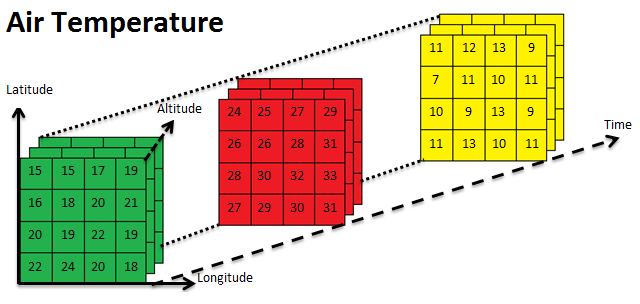
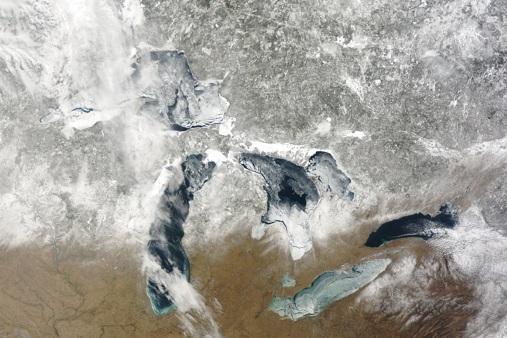

class: center, middle 

```{css echo=FALSE}
.highlight-last-item > ul > li, 
.highlight-last-item > ol > li {
  opacity: 0.5;
}
.highlight-last-item > ul > li:last-of-type,
.highlight-last-item > ol > li:last-of-type {
  opacity: 1;
}

.padded {
  padding-left: 70px
}
```

```{r xaringan-tile-view, echo=FALSE}
xaringanExtra::use_tile_view()
```

```{r xaringan-animate-all, echo=FALSE, eval=FALSE}
xaringanExtra::use_animate_all("slide_left")
```

```{r xaringan-tachyons, echo=FALSE}
xaringanExtra::use_tachyons()
```

```{r xaringan-logo, echo=FALSE}
xaringanExtra::use_logo(
  image_url = "images/sdsu.png",
  link_url = "https://github.com/villegar/presentations/tree/master/2020-07",
  position = xaringanExtra::css_position(bottom = "0em", left = "1em")
)
```

```{css, echo = FALSE}
.main_footer {
  align: center;
}
.main_footer img{
  max-width: 250px;
  height: 100px;
  float: left;
  vertical-align: middle;
  margin: 10;
}
```

# 10 años de Universidad
## Mi experiencia
<br />
<br />
<br />
### Roberto Villegas-Diaz
#### 13 de Julio, 2020

---
# Contenidos

- Práctica Empresarial

- CIGEFI-UCR: Centro de Investigaciones Geofísicas

- Beca CRUSA

- Entrenamiento y Desarrollo Profesional

- NOAA-GLERL: Laboratorio de Investigación Ambiental de los Grandes Lagos 

- ACM/IEEE Conferencia de Supercomputación (SC18 y SC19)

- SIMMAC: Simposio Internacional de Métodos Matemáticos Aplicados a las Ciencias

- Universidad Estatal de Dakota del Sur (SDSU)

---
class: center, middle
.bg-washed-green.b--dark-green.ba.bw2.br3.shadow-5.ph4.mt5[
The only way to write good code is to write tons of shitty code first. 
Feeling shame about bad code stops you from getting to good code

.tr[
— Hadley Wickham
]]
<br>
<br>
<br>
<br>

---
class: center, middle
<h1 style="color:#FFCC00; font-size: 100px"> &#x26A0;Precaución</h1>
<span style="font-size: 12px">La siguiente diapositiva contiene material gráfico que puede dejar daño permanente en sus retinas &#128064;</span>

---
background-image: url(images/2010.jpg)
background-size: cover
<span style="font-size: 12px">Universidad de Costa Rica, Recinto de Santa Cruz, 2010</span>

---
class: center, middle
# Práctica empresarial

.bg-washed-yellow.b--yellow.ba.bw2.br3.shadow-5.ph4.mt5[
The only way to do great work is to love what you do. If you haven’t found 
it yet, keep looking. Don’t settle. As with all matters of the heart, you’ll know when you find it.

.tr[
— Steve Jobs
]]

---
## Wind Turbine Design Tool
### (Abril $\sim$ Diciembre 2014)
<br>
.center[

]

---
## Problema
Automatizar el diseño de aerogeneradores (turbinas eólicas)

.center[
<br>
<span style="font-size: 12px">Cortesía de Ad Astra Rocket Company</span>
]

---
## Retos
1. Cálculos en $\mathbb{C}$
2. Análisis aerodinámico

  - Teorías de diseño aerodinámico
  - Curvas parámetricas
  - Modelado en 3D
  
3. Análisis de aerogeneración

---
### Cálculos en $\mathbb{C}$
Es una representación geométrica de los números complejos establecida por un eje real y un eje imaginario.
.center[
 <br>
 <span style="font-size: 12px">Wolfkeeper at English Wikipedia / [CC BY-SA](https://creativecommons.org/licenses/by-sa/3.0)</span>
]
¿Por qué usar números complejos?
<!-- $$x^2 + a = 0 \qquad a \in \mathbb{R}^+$$ -->

.padded[
 [Transformada de Fourier](https://es.wikipedia.org/wiki/Transformada_de_Fourier).
]

---
### Análisis aerodinámico: Teorías de diseño aerodinámico

- Optimal Design Variable Speed 
- Schmitz and Gundtoft
- Uniform Taper

Definición típica de un aspa
.center[
 <br>
 <span style="font-size: 12px">Gundtoft, S.; _Wind turbines_. University College of Århus. 2009 </span>
]

---
### Análisis aerodinámico: Curvas parámetricas
Perfiles arodinámicos
.center[
 <br>
 <span style="font-size: 12px">Abdullah, A.; Fadhli, M; _Numerical study of military airfoils design for compressible flow_. Dec. 2017</span>
]

.padded[
  Archivos de texto con valores $[-1,1]$ <br>
  Base de datos: http://goo.gl/zMtNxG ∼ 1600
]

---
### Análisis aerodinámico: Modelado en 3D

.center[
 <br>
 <span style="font-size: 12px">Forrister, T.; Fadhli, M; _Analyzing Wind Turbine Blades with the Composite Materials Module_. Nov. 2018</span>
]

.padded[
  Un aspa está formada por multiples secciones, cada una de ellas puede tener diferentes perfiles aerodinámicos.
]

---
### Análisis de aerogeneración

.center[
 <br>
 <span style="font-size: 12px">Windpower Products https://www.tlgwindpower.com/parts/PMA_500A.htm </span>
]
.padded[
  ¿Cómo uso esta curva (imagen) para analizar los resultados? <br>
  **Interpolación**
]

---
class: center, middle
# CIGEFI: Centro de Investigaciones Geofísicas
.center[
  
]

---
## Proyectos

1. Análisis de datos del CMIP5 (Coupled Model Intercomparison Project Phase 5)

2. Detección de Sistemas Convectivos de Mesoescala (MCS)

3. Trabajo con otros set de datos meteorológicos

---
### Análisis de datos del CMIP5
```{r, echo=FALSE}
db <- rbind(c("Nombre", "NASA Earth Exchange Global Daily Downscaled Projections (NEX-GDDP)"),
            c("Tamaño", "12 TB"),
            c("Resolución espacial", "0.25 grados × 0.25 grados ~ 27.75 km × 27.75 km"),
            c("Cobertura temporal", "1950 − 2005 historical 2006 − 2100 RCP"),
            c("Variables", "tasmin, tasmax, precipitation")
           )
knitr::kable(db, "html")
```

¿Qué formato se usa para almacenar estos datos? <br>
[NetCDF](https://www.unidata.ucar.edu/software/netcdf/docs/): Network Common Data Form

.center[
  <br>
  <span style="font-size: 12px">[GeoSolutions](https://geoserver.geo-solutions.it/edu/en/multidim/netcdf/netcdf_basics.html); *NetCDF-family serving basics*</span>
]

---
### Climatologías
.center[
   
  
  
]

.padded[
  Anuales y estacionales y mensuales.
]

---
### Detección de Sist. Convectivos de Mesoescala

Máscara de temperatura __>__ Vecindades __>__ Monitorear
.center[
   
]

.padded[
  <span style="font-size: 12px">
  **Referencia:** Fiolleau, T.; Roca, R.; *An Algorithm for the Detection and Tracking of Tropical Mesoscale Convective Systems Using Infrared Images From Geostationary Satellite,* in IEEE Transactions on Geoscience and Remote Sensing, vol. 51, no. 7, pp. 4302-4315, July 2013, doi: [10.1109/TGRS.2012.2227762](10.1109/TGRS.2012.2227762).<br>
  Repositorio: https://github.com/cigefi
  </span>
]

---
class: center, middle
# Beca CRUSA

.center[
  
]

.footnote[.padded[.left[
 Sitio web: https://crusa.cr
]]]

---
class: highlight-last-item
## Recursos
1. Chevening: [https://www.chevening.org](https://www.chevening.org/scholarship/costa-rica/)<br>
Becas para el Reino Unido

--

2. EducationUSA: [https://educationusa.state.gov](https://educationusa.state.gov/centers/educationusa-advising-center-centro-cultural-costarricense-norteamericano)<br>
Becas para los Estados Unidos de América

--

3. Fullbright: [https://cr.usembassy.gov/](https://cr.usembassy.gov/education-culture/educational-exchange/fulbright-program/)<br>
Becas para los Estados Unidos de América

--

4. Jobbnorge: [https://www.jobbnorge.no](https://www.jobbnorge.no/search/en)<br>
Postgrados y Trabajos en Noruega

--

5. MetJobs: [Archivo](https://www.lists.rdg.ac.uk/archives/met-jobs/) -  [Suscripción](https://www.lists.rdg.ac.uk/mailman/listinfo/met-jobs)<br>
Postgrados y Trabajos en Ciencias Atmósfericas
--

6. MICITT: https://www.micit.go.cr/becas<br>
Financiamiento para Postgrados

---
class: center, middle
# Entrenamiento y Desarrollo Profesional

---
class: highlight-last-item
## Recursos
1. Coursera: https://www.coursera.org

--

2. edX: https://www.edx.org

--

3. Kabré - CeNAT: https://kabre.cenat.ac.cr <br>
Supercomputadora y Entrenamiento en Computación Avanzada

--

4. Khan Academy: https://www.khanacademy.org 

--

5. MetPy Mondays: [[YouTube](https://www.youtube.com/playlist?list=PLQut5OXpV-0ir4IdllSt1iEZKTwFBa7kO)] <br>
Cursos cortos semanales de aplicaciones en Ciencias Atmosféricas.

--

6. R4DS: [[Slack](r4ds.io/join)] <br>
Comunidad de R enfocada en Análisis de Datos.

---
class: highlight-last-item
## Escuelas de Verano y Conferencias
1. ECMWF Summer of Weather Code (ESoWC): https://esowc.ecmwf.int [Remoto + Salario]

--

2. Google Summer of Code: https://summerofcode.withgoogle.com [Remoto + Salario]

--

3. International HPC Summer School: http://www.ihpcss.org [Financiado]

--

4. International Conference for High Performance Computing, Networking, Storage and Analysis (SC Conference): http://supercomputing.org [Financiado]

--

5. Practice & Experience in Advanced Research Computing
Conference Series (PEARC): https://pearc.acm.org [Fondos disponibles]
---

class: center, middle
# NOAA-GLERL: Laboratorio de Investigación Ambiental de los Grandes Lagos 

.center[
   
  <span style="font-size: 150px;">|</span>
  
]

---
### Grandes Lagos (1)
- Lagos: Superior, Huron, Michigan, Erie, Ontario
- Superficie: 244,079 km<sup>2</sup> $\sim$ 4.7 superficie de Costa Rica 
- $\sim$ 95% agua dulce USA
.center[
  
]

.padded[
Más información: https://www.glerl.noaa.gov/education/ourlakes/lakes.html
]

---
### Grandes Lagos (2)
.center[
  
  <br>
  
]

---
class: center, middle
# ACM/IEEE Conferencia de Supercomputación (SC18 y SC19)

.center[
   
  <span style="font-size: 150px;">|</span>
  
]

---
background-image: url(images/1118-SCinet-sc19-17.jpg)
background-size: cover

---
class: center, middle
# SIMMAC: Simposio Internacional de Métodos Matemáticos Aplicados a las Ciencias

.center[
   
  <span style="font-size: 150px;">|</span>
  
  <span style="font-size: 150px;">|</span>
  
]

---
background-image: url(images/simmacXXII.jpg)
background-size: cover

---
class: center, middle
# Universidad Estatal de Dakota del Sur

---
## División de Redes e Investigación en Computación (UNRC)

Supercomputador/clúster *Roaring Thunder* @ SDSU:

```{r, echo=FALSE}
db <- rbind(c("56 nodos generales", "40 CPUs; 190 GB RAM"),
            c("5 nodos de gran memoria", "80 CPUs; 3 TB RAM"),
            c("4 nodos gráficos", "40 CPUs; 190 GB RAM; NVIDIA P100 & V100"),
            c("Procesador", "Intel(R) Xeon(R) Gold 6148 CPU @ 2.40GHz"),
            c("Almacenamiento", "DDN GPFS 1.2 PB"),
            c("Total", paste0(60*40 + 5*80, " CPUs; ", (60*190 + 5*3000)/1000, " TB"))
           )
knitr::kable(db, "html")
```

---
### ¿Cómo se ve y qué es un supercomputador?
.pull-left[
  <br>
  <span style="font-size: 12px">SDSU Collegian/Brookings Register</span>
]

.pull-right[
<h1 style="color:#FFCC00; font-size: 25px"> &#x26A0;Precaución: Analogía</h1>

Imaginen un profesor con multiple asistentes, cada uno puede trabajar de manera independiente (revisan-do tareas, monitoreando laborato-rios, etc.), **pero** de ser necesario, los asistentes pueden dividirse un mis-mo _trabajo_ y obtener resultados mucho más rápido. 

<h1 style="font-size: 25px"> Definición</h1>
"... dispositivo informático con capacidades de cálculo superiores a las computadoras comunes y de escritorio y que son usadas con fines específicos." - [Alguién en Wikipedia](https://es.wikipedia.org/wiki/Supercomputadora)
]

---
### ¿Qué se puede hacer con estos recursos?

- Ensamblaje y anotación de genomas
- Procesamiento de imágenes satelitales [por ejemplo: [Lansat](https://landsat.gsfc.nasa.gov)]
- Simulaciones en 
  - Dinámica de fluídos  
  - Física de altas energías (nuclear, partículas)
  - Interacción de compuestos químicos 
- Y muchas más 

### ¿Y yo qué hago?

- Ayudar a investigadores a implementar sus flujos de trabajo.
- Impartir clases en: lenguajes de programación, operación del clúster, administración y transferencia de datos, programación en paralelo, y otros
- Mantenimiento de software: compilar y optmizar nuevas versiones, preparar casos de uso y documentación.

---
## Departamento de Ciencia de Plantas: Laboratorio Fennell

---
class: center, middle

# ¡Muchas gracias!

.footnote[.padded[.left[
  Presentación creada usando el paquete de R [**xaringan**](https://github.com/yihui/xaringan).
  
  Si, el nombre de la librería es inspirado por [Naruto](https://en.wikipedia.org/wiki/Naruto).
]]]

---
class: center, middle

# ¿Preguntas?

---
class: center, middle
# Contacto

Roberto Villegas-Diaz: <br>
[contact@robertovillegas-diaz.com](mailto:contact@robertovillegas-diaz.com)

Github: [@villegar](https://github.com/villegar)

Twitter: [@roberthillo](https://twitter.com/roberthillo)

<a href="https://www.linkedin.com/in/roberto-villegas-diaz"><br>
<span style="font-size: 12px">LinkedIn</span></a>
```{r, echo = FALSE, fig.width=3, eval=FALSE}
library(qrcode)
png("images/linkedin.png")
qrcode_gen("https://www.linkedin.com/in/roberto-villegas-diaz")
dev.off()
```
