class: center, middle, hide_logo

```{r setup, include=FALSE}
options(htmltools.dir.version = FALSE)
# The official UoL fonts can be accessed here:
# https://www.liverpool.ac.uk/intranet/brand-identity/brand-toolkit/fonts/
```

```{r load-data, echo = FALSE}
xaringanExtra::use_logo(
  image_url = "images/uol_logo.png",
  link_url = "https://www.liverpool.ac.uk",
  width = 200, #568,
  height = 52, #146,
  position = xaringanExtra::css_position(top = "1em", right = "1em")
)
```

```{r helper_functions, echo = FALSE, warning = FALSE, message = FALSE}
source("hexwall.R")
insert_qr <- function(URL, caption, ecl = "M", size = 250, img_dir = "./images") {
  filename <- caption |>
    stringr::str_to_lower() |>
    stringr::str_squish() |>
    stringr::str_replace_all(" ", "_")
  filename <- file.path(img_dir, paste0("qr_", filename, ".svg"))
  qrcode::qr_code(URL, ecl = ecl) |>
    qrcode::generate_svg(filename = filename,
                         size = size,
                         show = FALSE)
  cat("\n\n.center[
      
      ]\n\n",
      paste0("<span class='qr-caption'>", caption, "</span>")
      )
}
```

# R-thritis Meet-Up: 
# Fun with R - Creating a custom R package

<br />

### Roberto Villegas-Diaz (he/him)
#### Data Manager – GroundsWell Consortium


---

# Overview

- GroundsWell Consortium
- Motivation
- Demo: Creating a custom R package
- Beyond the basics
  - Tests
  - Vignettes
  - Documentation++
- References

---

## GroundsWell: Transforming our cities from the ground up

.pull-left[

- Establish important baseline health and environment factors

- Layering co-produced existing data and interventions (e.g. to encourage use of local parks by people who do not ordinarily use them)

- Assessing the impact on health and wellbeing (evidence)

```{r, echo = FALSE, results='asis'}
insert_qr("https://www.groundswelluk.org", 
          "GroundsWell Consortium",
          size = 150)
```

]

.pull-right[

  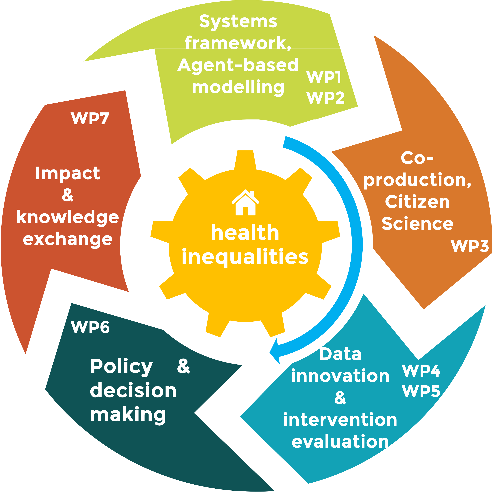
  
  

]

---

class: center, middle

# Motivation

---

## What is a package?

> A package bundles together code, data, documentation, and tests, and is easy to share with others [[5](#references)]


--

For a very detailed overview of all the steps necessary to create your own packages, see this book:<br /> https://r-pkgs.org

.pull-left[
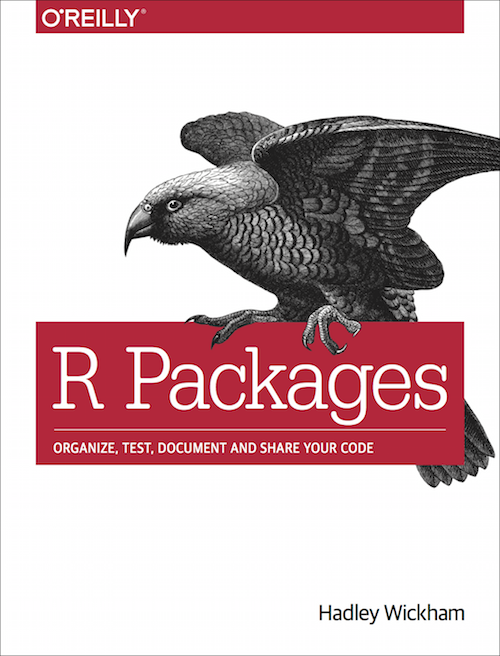
]

.pull-right[
```{r, echo = FALSE, results='asis'}
insert_qr("https://r-pkgs.org", 
          "R packages book",
          size = 350)
```
]

---

## Why should we build packages?

- Reuse functions
- Standardised documentation
- Unit tests
- Contribute to the scientific community

.pull-left[

```{r, echo = FALSE, out.height = 400}
knitr::include_graphics("https://easystats.github.io/easystats/reference/figures/logo_wall.png")
```

]

.pull-right[

- And of course, to create cool hex stickers and stick them on your work laptop.

```{r, echo = FALSE, results='asis'}
insert_qr("http://hexb.in", 
          "Community-curated hex stickers",
          size = 250)
```

]

---

## Where can I publish my work?

Firstly, you packages don't have to be public (i.e. you can create packages for internal use only).

- __CRAN (most popular):__ Comprehensive R Archive Network, https://cran.rstudio.com

```{r, eval = FALSE}
install.packages("trainR")
```

--

- __Bioconductor (bioinformatics focused):__ https://bioconductor.org

```{r, eval = FALSE}
BiocManager::install("DESeq2")
```

--

- __GitHub (GitLab, Bitbucket, etc.):__ a more general software development and version control platform, https://github.com

```{r, eval = FALSE}
remotes::install_github("villegar/trainR", "dev")
```

---

## Can I get a DOI for my package? 

Yes, of course. There are few websites where you can submit your work.

- The Journal of Open Source Software (JOSS): https://joss.theoj.org

- The R Journal: https://journal.r-project.org

- Zenodo: https://zenodo.org

--

For example:

> Villegas-Diaz, R., 2021. _trainR: An Interface to the National Rail Enquiries Systems (0.0.1)_. Zenodo. https://doi.org/10.5281/zenodo.4506591


There are many more options, see this blog post [[1](#references)]. 

For some tips on promoting your shiny new package, look here [[3](#references)].

.footnote[
DOI: Digital Object Identifier
]

---

## What do we need? (1)

- R & RStudio: https://posit.co/download/rstudio-desktop/
  - ⚠️️ Windows OS’ users: you might need to first install the RTools toolkit:
  <br /> https://cran.r-project.org/bin/windows/Rtools/

.pull-left[

- Install the following packages:
  - [devtools](https://devtools.r-lib.org) / [CRAN](https://cran.r-project.org/package=devtools)
  - [roxygen2](https://roxygen2.r-lib.org) / [CRAN](https://cran.r-project.org/package=roxygen2)
  - [usethis](https://usethis.r-lib.org) / [CRAN](https://cran.r-project.org/package=usethis)
  - [pkgdown](https://pkgdown.r-lib.org) / [CRAN](https://cran.r-project.org/package=pkgdown)
  - [testthat](https://testthat.r-lib.org) / [CRAN](https://cran.r-project.org/package=testthat)
]

.pull-right[

  Run the following lines inside RStudio:
  ```{r, eval = FALSE}
  install.packages("devtools")
  install.packages("roxygen2")
  install.packages("usethis")
  install.packages("pkgdown")
  install.packages("testthat")
  ```

]

```{r, echo = FALSE, warning = FALSE, message = FALSE}
hexwall("images/hex-stickers/", sticker_row_size = 6, sticker_width = 170)
```

---

## What do we need? (2)

- Patience (it gets tricky sometimes)

.center[
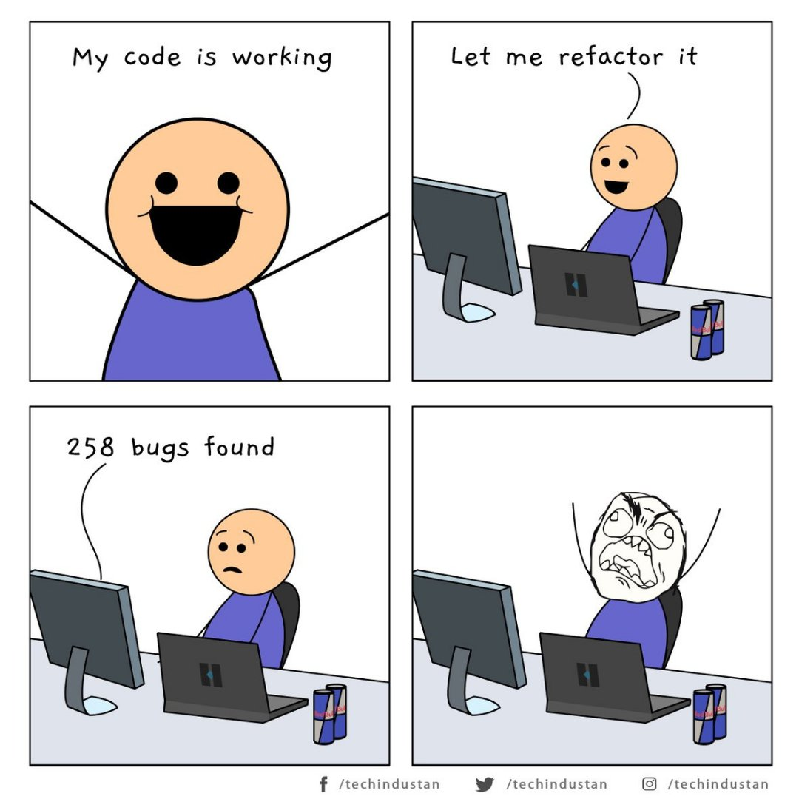
<span class="img-caption">Source: https://twitter.com/codecorecollege/status/1450945058220429321<span>
]

---
class: hide_logo
background-image: url("images/enough-talk-show.jpg")
background-position: center
background-size: contain

---

class: center, middle

# Demo: Creating a custom R package

## (in less than 1000 steps)

---

## Step-by-step (1)

- Inside RStudio, navigate to

  ```bash 
  File > New Project...
  ```
  
  The following window should be displayed:
  .center[
  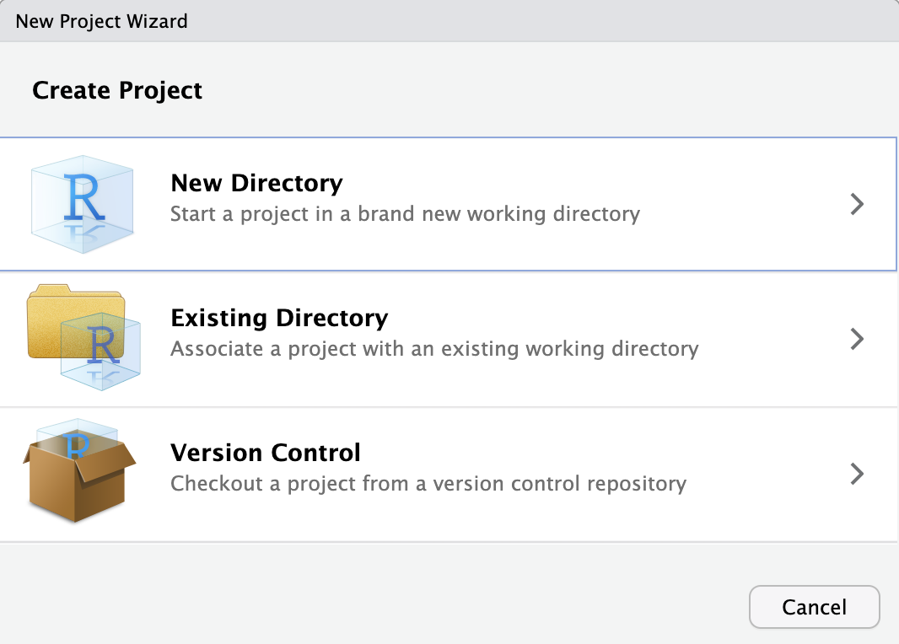
  ]

---


## Step-by-step (2)

- Click on 

  ```bash
  New Directory > R Package
  ```
  
  The following window should be displayed:
  .center[
  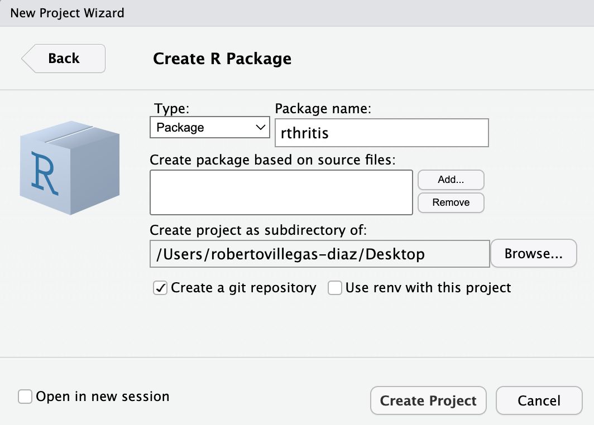
  ]
  
  Choose the name of your package (alphanumeric and underscore only), then click on `Create Project`.
  
---

## Step-by-step (3)

.center[
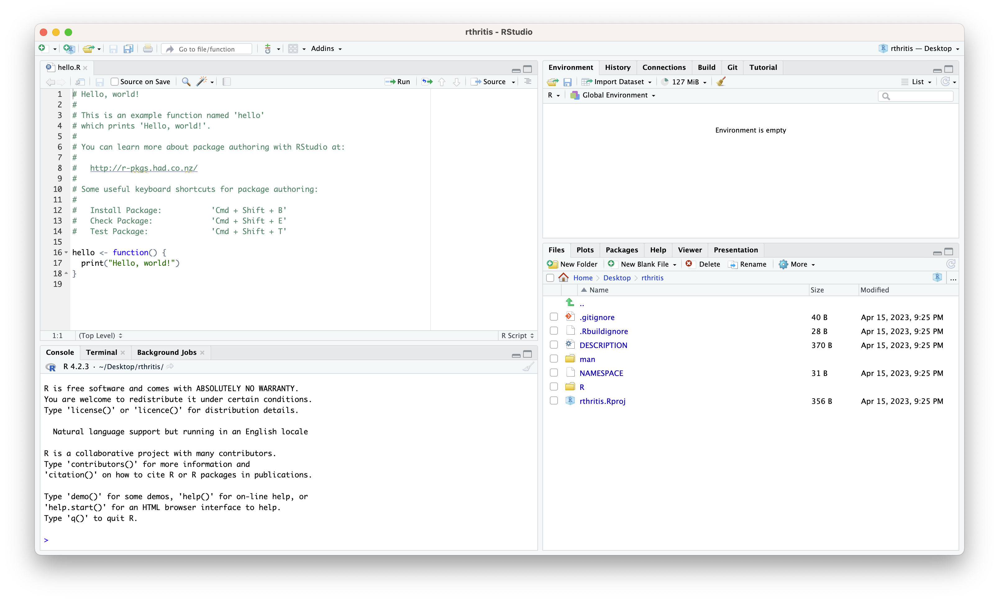
]

---

## Step-by-step (4)

RStudio should create the following files and directories for you (check the panel in the lower right corner, `Files` tab):

.pull-left[

]

.pull-right[

- `.gitignore`: list of files to be ignored from version control.
- `.Rbuildignore`: list of files to be ignored from the build of the package.
- `DESCRIPTION`: this file contains metadata about your package (e.g. title, description, author(s), license, dependencies, etc.).
- `man` [directory]: contains the documentation of your package.
- `NAMESPACE`: auto-generated file listing functions, datasets and other objects in the package.
- `R` [directory]: contains your R scripts
- `rthritis.Rproj`: file with the details of your project (e.g. working directory, settings, etc.).
]

---

## Step-by-step (5)

Before we carry on with the setup of our project, we should delete the existing `man` and `R` directories (we are not interested in the default functions created by RStudio).

.pull-left[
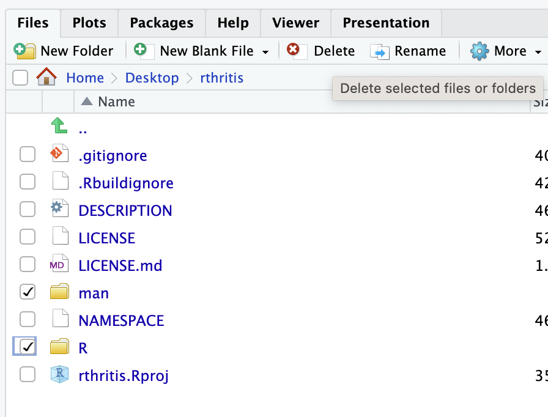
]


.pull-right[
Click on Yes:

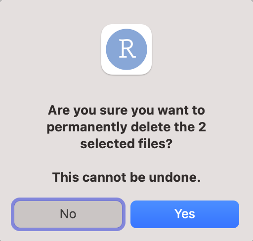
]


---

## Step-by-step (6)

I like to overwrite the template created by RStudio for the `DESCRIPTION` file, this can be done by executing the following line of code (in the `Console` tab, bottom left panel):

```{r, eval = FALSE}
usethis::use_description()
```

You will be asked to acknowledge the changes, note that the option to overwrite is __NOT__ always the first one (1), so make sure you pick the right number and hit Enter/Return.

.pull-left[

]

.pull-right[
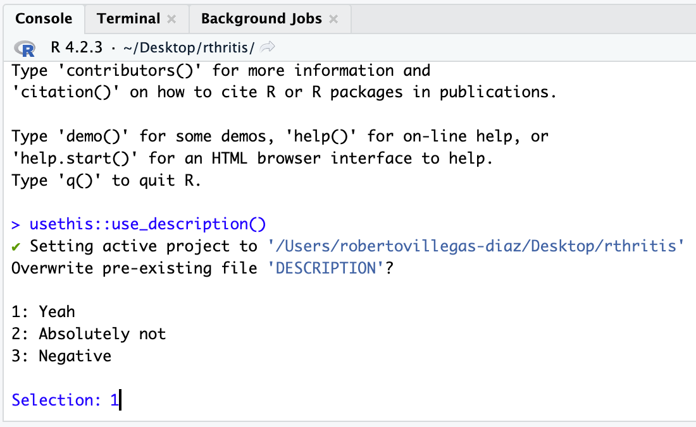
]

---

## Step-by-step (7)

Next, let's pick a license for our package. [Chapter 13](https://r-pkgs.org/license.html) of [[5](#references)] covers in detail how to choose a license, I usually pick the MIT license (a very permissive one). To add your license, you can use the `usethis` package, choose the appropriate `usethis::use_LICENSE_license` function, where `LICENSE` should be replaced by your choice of license.

In my case, to use the MIT license:
```{r, eval = FALSE}
usethis::use_mit_license(copyright_holder = "GroundsWell Consortium")
```

.center[
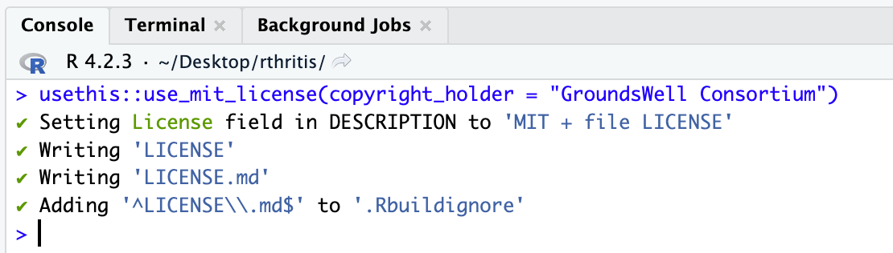
]

---

## Step-by-step (8)

We need to update one more file, the `NAMESPACE`, so it lists all our new functions. We can do this by running the following command:

```{r, eval = FALSE}
usethis::use_namespace()
```

.center[
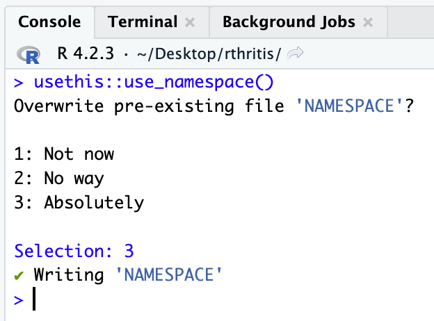
]

---

## Step-by-step (9)

One more file (I promise), now that we have updated few files, we can update the `DESCRIPTION` file and add our name, a title, a short description, etc.

.pull-left[
__Original:__
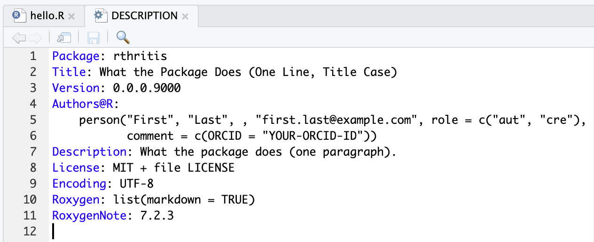
]

.pull-right[
__Edited:__
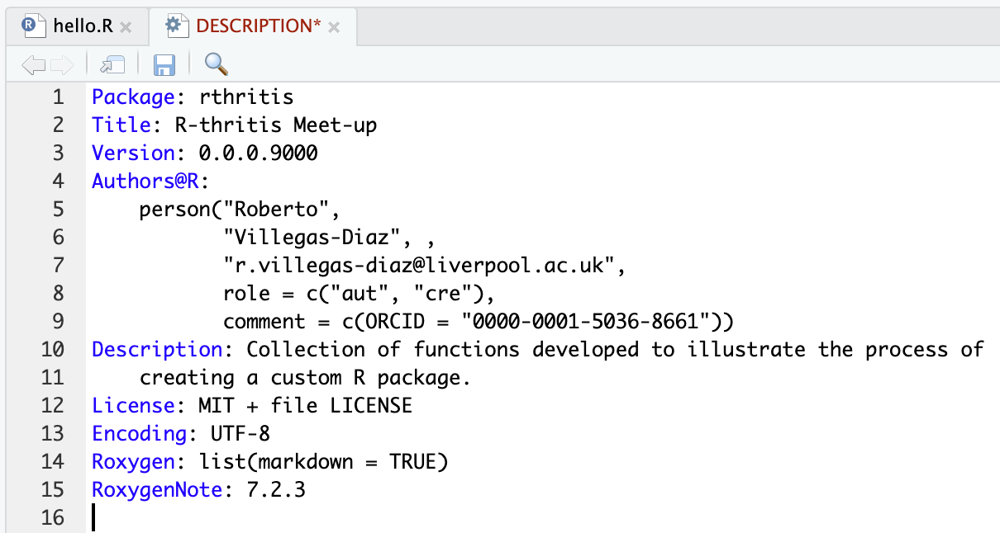
]

Example of `DESCRIPTION` file for a package I published on the CRAN: <br/> https://github.com/special-uor/fxTWAPLS/blob/master/DESCRIPTION


---
class: hide_logo
background-image: url("images/tired-spongebob-sqpants.webp")
background-position: center
background-size: contain

---
## Step-by-step (10)

Let's create our first function (üéâ), using the following command we can create new scripts inside the `R` directory:

```{r, eval = FALSE}
usethis::use_r(name = "utils")
```

You can pick any name for your file, I have chosen `utils` as this will be my file with utilitarian functions.

Next, we can edit this file to create our first function (the file should be in your code `Editor` panel, left upper panel):

```{r, eval = FALSE}
area_circle <- function(r) {
  area <- pi * r ^ 2
  message("The area of a circle with radius ", r, " is ", area)
  return(area)
}
```

---
## Step-by-step (11)

This function is still missing one of the __key__ components of functions in a package, __DOCUMENTATION__.

To add the _skeleton_ (template) documentation, place your cursor over the function name (anywhere), then click on `Code > Insert Roxygen Skeleton`:

.pull-left[
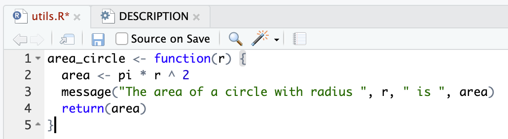
]

.pull-right[
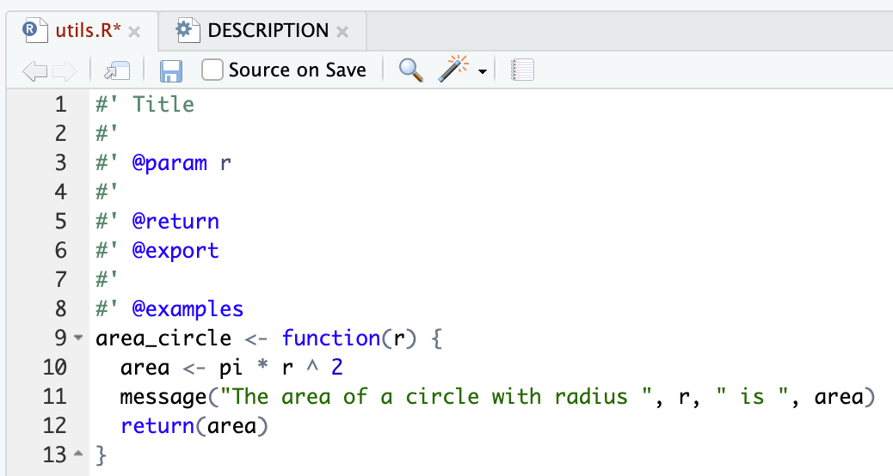
]

If you are familiar with code documentation in R, you will recall that we use `#` before writing comments. Roxygen uses an additional character, `'`, to distinguish between regular comments and package documentation, `#` vs `#'`.

---

## Step-by-step (12)

In addition to the special notation for the documentation, `#'`, you might have noticed that the are some words with `@` as prefix (e.g. `@export`), these are special fields to mark different sections of the documentation.

For this tutorial, we care about the following:

- `@param`: used to describe the parameters of a function.
- `@return`: used to describe the return object (if applicable) of the function.
- `@export`: used to indicate that the function is "public", without it, the function will be available for "internal" use only.
- `@examples`: used to add examples on how to use the function.

You can find more details here [[7](#references)] and [Chapter 17](https://r-pkgs.org/man.html) of [[5](#references)].

```{r, echo = FALSE, results='asis'}
insert_qr("https://roxygen2.r-lib.org/articles/rd.html", 
          "Roxygen2 - Documenting functions",
          size = 200)
```

---

## Step-by-step (13)

Now, we can update the documentation. Roxygen uses the first line as the function title, then you can add a short description (leave a line between the `title` and `description` sections). Alternatively, you can use the `@title` and `@description` tags.

.center[
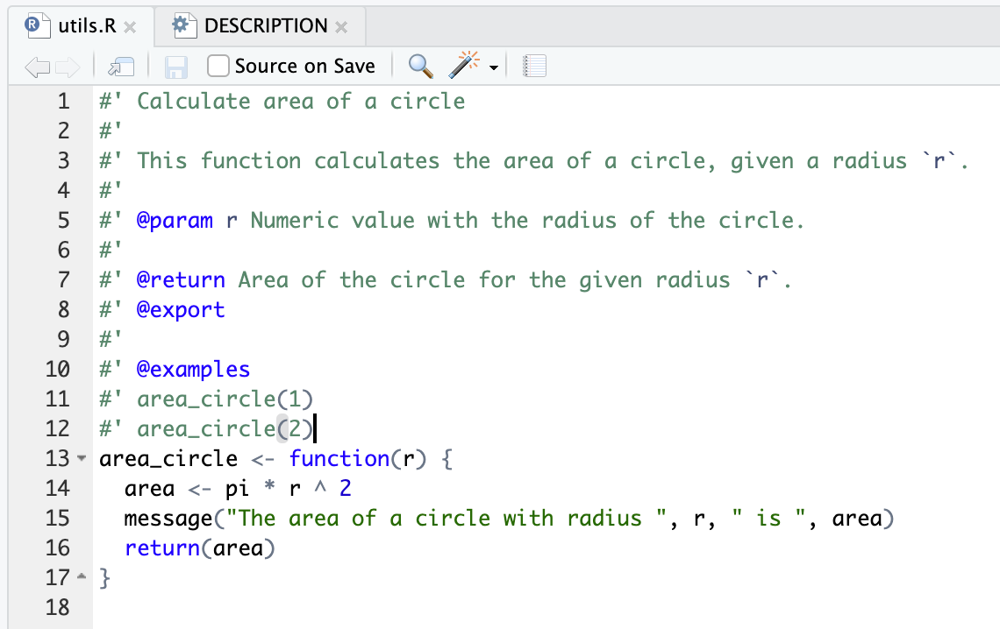
]

---

## Step-by-step (14)

Before doing our first build, we need to generate the documentation, this can be done using the following command:

```{r, eval=FALSE}
devtools::document()
```

.pull-left[
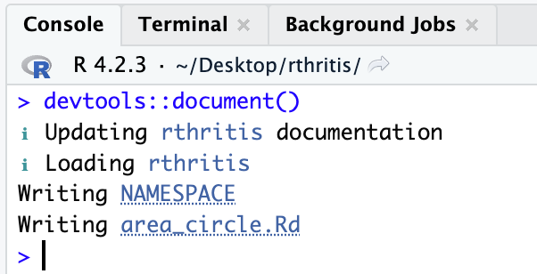
]

.pull-right[
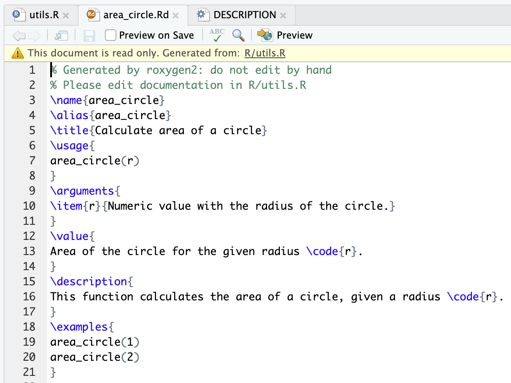
] 

---

## Step-by-step (15)

Let's create our first build. Navigate to the `Build` tab (right upper panel), then click on

```bash
More > Build Source Package
```

.pull-left[

]

.pull-right[
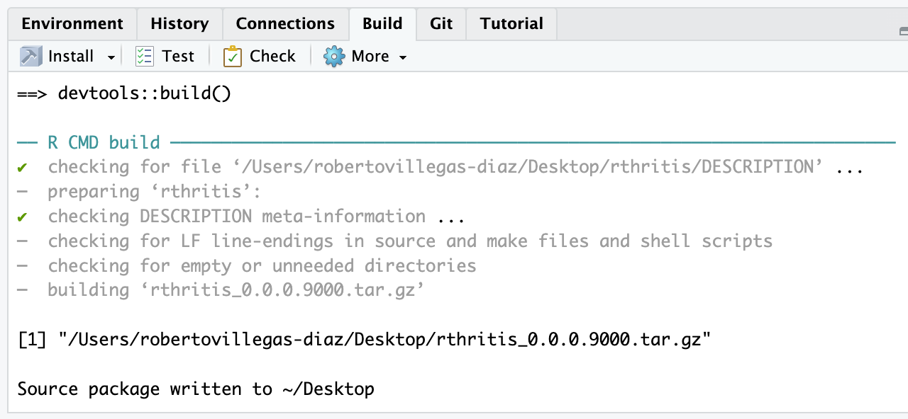
]

---

## Step-by-step (16)

Before installing our package, it's a good idea to _check_ that its contents (documentation, examples, tests, etc.) are valid/correct. Navigate to the `Build` tab (right upper panel), then click on `Test`:

.center[
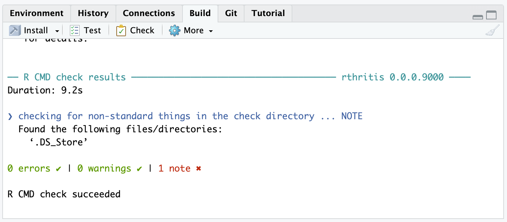
]

Notes are usually harmless, but you have to deal with them if you want to publish your package on the CRAN.

---

## Step-by-step (17)

Finally, we can install and test our package. To install it, navigate to the `Build` tab (right upper panel), then click on `Install`:

.center[
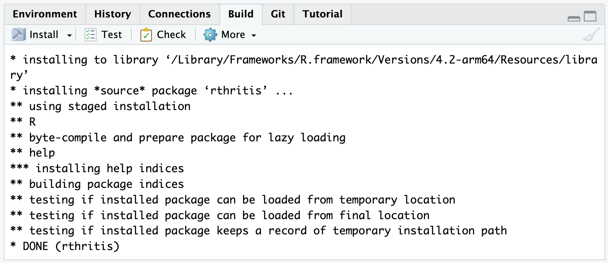
]


---

## Step-by-step (18)

Let's test our package. You can load the entire package to your R session with the `library` function and then execute the function you want:

```{r, eval = FALSE}
library(rthritis)
area_circle(2)
```

Or, you can call the function directly using the `PACKAGE::FUNCTION` notation:

```{r, eval = FALSE}
rthritis::area_circle(2)
```

Both, will result in the same output:

.center[
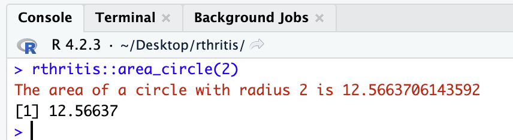
]

---

## Step-by-step (19)

To checkout the documentation, you can run the following command:

```{r, eval = FALSE}
?rthritis::area_circle
```

.center[
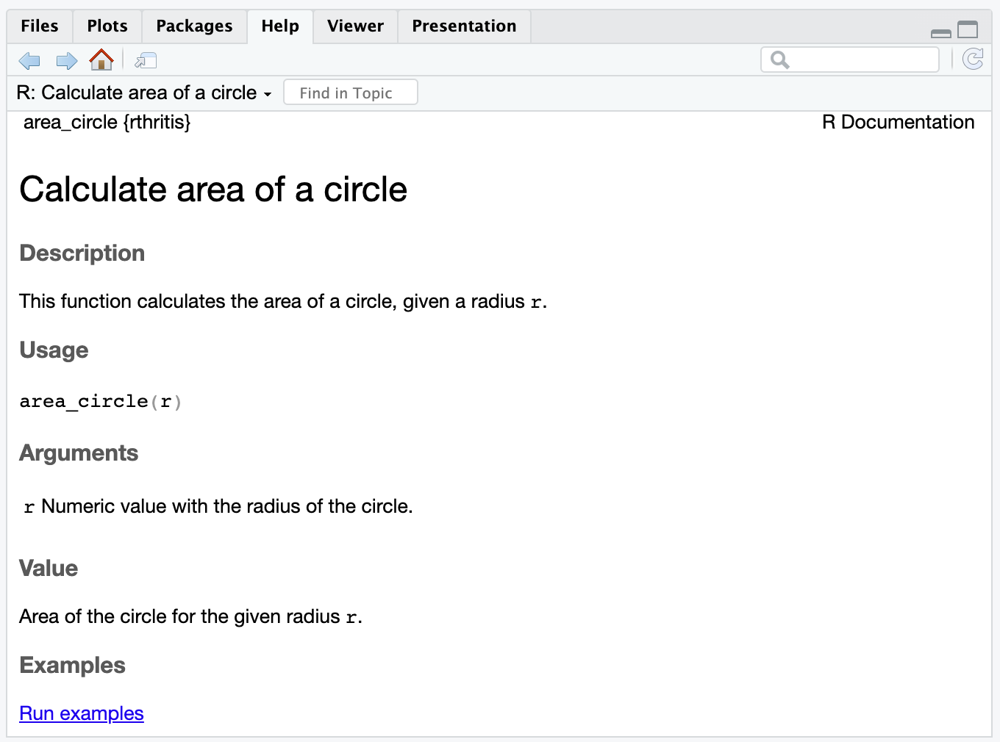
]

More generally, you can run `?PACKAGE::FUNCTION`.

---

class: hide_logo
background-image: url("images/coding_makes_me_laugh_cry.webp")
background-position: center
background-size: contain


---

## Step-by-step (20)

Generalising, you can run the following 3 lines of code, every time you want to _document_, _check_ and _install_ the latest version of your package:

```{r, eval = FALSE}
devtools::document()
devtools::check()
devtools::install()
```

---

class: center, middle

# Beyond the basics

---

## Tests

> Testing your code can be painful and tedious, but it greatly increases the quality of your code. [[4](#references)].


### Implementing tests

We can start by running the following command in the `Console` tab (lower left panel):

```{r, eval = FALSE}
usethis::use_test("utils")
```

You can choose any name you want for the test file, but it's a good practice to use the same name as the script that contains the functions you will be testing, here `utils`.

.center[
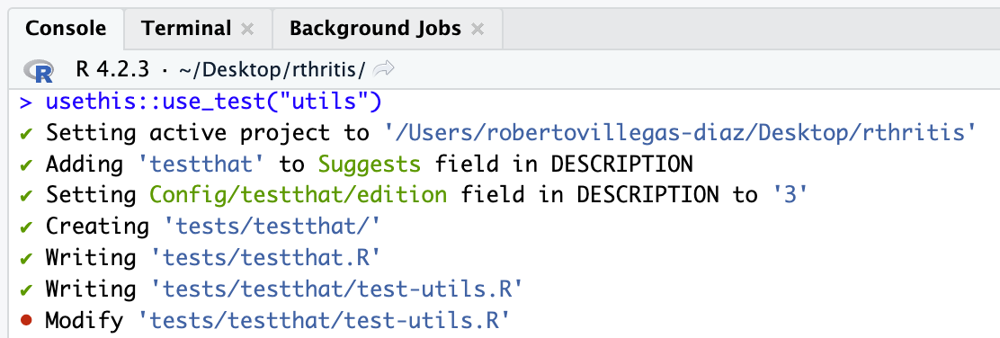
]

---

## Tests (2)

You should see a new file called `test-utils.R` on the code editor:

.pull-left[
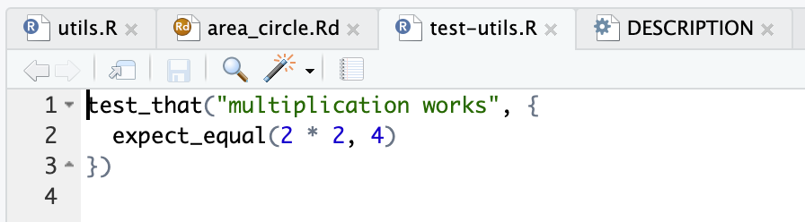

We can ignore the example test and write our own tests, for example:

```{r, eval = FALSE}
test_that("area_circle works", {
  area <- area_circle(2)
  expect_equal(area, pi * 2 ^ 2)
  # test for invalid radius, a string
  expect_error(area_circle("2"))
})
```

]

.pull-right[

There are two tests here, one expecting to match `expect_equal` the output of the function. And another one, trying to "break" the function, by passing an invalid parameter to the function call, `expect_error`:

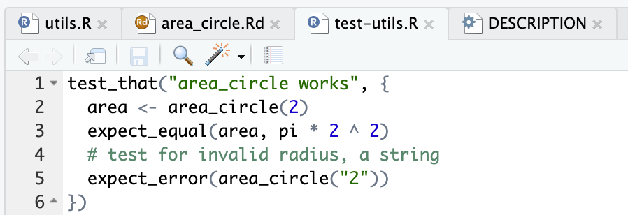
]

---

## Tests (3)

To execute the tests you have created, you can navigate to the `Build` tab (right upper panel), then click on `Test`. Alternatively, you can run the following command in the `Console` tab (lower left panel):

```{r, eval = FALSE}
devtools::test()
```

You should see something similar to the following output:

.center[
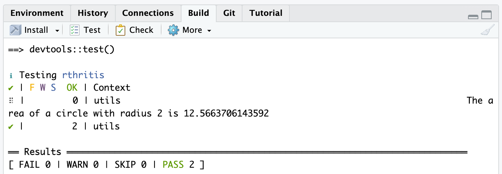
]

---

## Tests (4)

For more details about unit tests in R, checkout the documentation for the `testthat` package: https://testthat.r-lib.org/articles/third-edition.html [[4](#references)] and [Chapter 14](https://r-pkgs.org/testing-basics.html) of [[5](#references)].


.center[
```{r, echo = FALSE, out.height = 413, out.width=460, fig.cap="https://9gag.com/gag/ayMmqyb"}
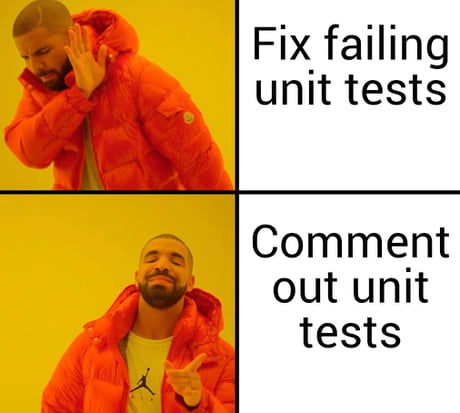
```
]

---

## Vignettes (1)

> A vignette is a long-form guide to your package ... perfect for showing a workflow that solves that particular problem, start to finish. [[5](#references)]

### Implementing vignettes

We can start by running the following command in the `Console` tab (lower left panel):

```{r, eval = FALSE}
usethis::use_vignette("cfe_vs_rthritis", title = "Centre for Epidemiology Versus Arthritis")
```

You can choose any name you want for the vignette file, but I suggest a short version of the title.

.center[
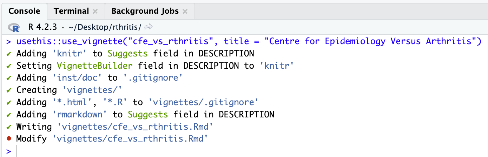
]

---

## Vignettes (2)

The new vignette file should automatically open on your code editor, then you can start editing and add all the relevant details (text, code, figures, etc.) to create an useful guide to your package.

.center[
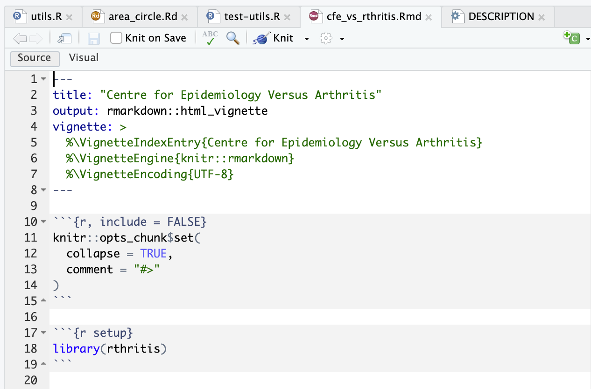
]

More details about vignettes can be found in [Chapter 18](https://r-pkgs.org/vignettes.html) of [[5](#references)].

---

## Documentation++ (1)

We previously documented a function, but we can also add more details about the package itself. 

Once again, we can use `usethis` to create the necessary files:

```{r, eval = FALSE}
usethis::use_package_doc()
```

This command will generate a new R script called `{pkgname}-package.R`. Next, we need to _document_, _check_ and _install_ the latest version of the package:

```{r, eval = FALSE}
devtools::document()
devtools::check()
devtools::install()
```

Then, we can inspect the documentation for the package with the following command:

```{r, eval = FALSE}
help(rthritis)
```

---

## Documentation++ (2): README

It is a good practice to include a README file in your package. This file can be used to tell users where to get the package (including development versions), how to install it (this assumes the package is hosted somewhere online), provide details about citing the package, links to publications, etc.

To create a README file, run the following command:

```{r, eval = FALSE}
usethis::use_readme_rmd()
```

.center[
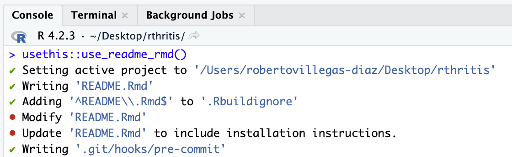
]

Edit this file and add any relevant details about your package.

---

## Documentation++ (3): Website

Using `pkgdown`, it is possible to generate a website with your package's documentation and vignettes, which can be a more user friendly way to share your work.

To set up the website, you can run the following command:

```{r, eval = FALSE}
usethis::use_pkgdown()
```

.center[
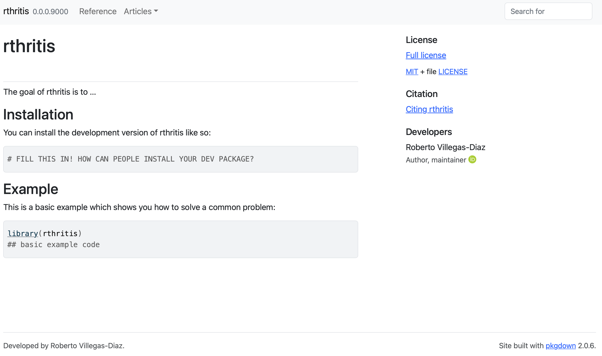
]

To locally deploy the website for your package, you can run the following command:

```{r, eval = FALSE}
pkgdown::build_site()
```

---

## Documentation++ (4): Website

.center[

]

Find more details about `pkgdown` here [[8](#references2)] and [Chapter 20](https://r-pkgs.org/website.html) of [[5](#references)].

---

class: center, middle

# Thank you!

.center[
```{r, echo = FALSE, results='asis'}
insert_qr("mailto:r.villegas-diaz@liverpool.ac.uk?subject=R-thritis - R packages", 
          "r.villegas-diaz@liverpool.ac.uk",
          size = 300)
```
]

GitHub: https://github.com/villegar

Slides created using [**xaringan**](https://github.com/yihui/xaringan).


---
name: references
# References (1)

[1] Dhanraj, N., 2020. _How to publish R packages in good journals_.<br /> https://neerajdhanraj.medium.com/how-to-publish-r-packages-in-good-journals-55a3153bd409

[2] Moraga, P., 2022. _Building R packages_. <br/>https://www.paulamoraga.com/blog/2022/04/12/2022-04-12-rpackages/

[3] Turner, H., 2020. _Publishing and Promoting your R Package_. https://www.heatherturner.net/talks/publishing-and-promoting-r-packages

[4] Wickham, H., 2011. _testthat: Get Started with Testing._ The R Journal, vol. 3, no. 1, pp. 5--10.
  
[5] Wickham, H. and Bryan, J., 2023. _R packages (2e)_. https://r-pkgs.org

[6] Wickham, H., Bryan, J., Barrett, M., 2022. _usethis: Automate Package and Project Setup_. R package version 2.1.6, <https://CRAN.R-project.org/package=usethis>.

[7] Wickham, H., Danenberg P., Cs√°rdi G., Eugster M., 2022. _roxygen2: In-Line Documentation for R_. R package version 7.2.3, <https://CRAN.R-project.org/package=roxygen2>.

---
name: references2
# References (2)

[8] Wickham, H., Hesselberth, J., Salmon, M., 2022. _pkgdown: Make Static HTML Documentation for a Package_. R package version 2.0.6, <https://CRAN.R-project.org/package=pkgdown>.

[9] Wickham, H., Hester, J., Chang, W., Bryan, J., 2022. _devtools: Tools to Make Developing R Packages Easier_. R package version 2.4.5, <https://CRAN.R-project.org/package=devtools>.
